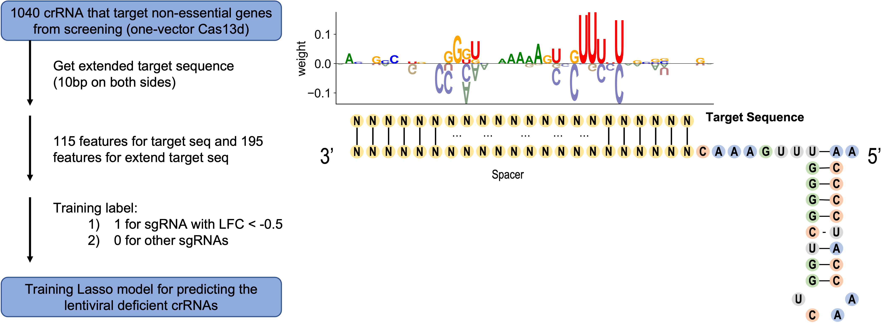

# Cas13_Lasso

A lasso-based machine learning model for calculating Cas13d  lentiviral deficiency score. This model is used in our paper [Intrinsic RNA targeting constrains the utility of CRISPR-Cas13 systems](https://www.biorxiv.org/content/10.1101/2022.05.14.491940v1)



Cas13 systems under lentiviral vectors exhibit differential levels of lentiviral deficiency by which lentiviral Cas13 compoments cannot be properly packaged and delivered through lentivirus particles.

For one-vector RfxCas13d system in which Cas13d and its sgRNA cassette are in the same lentiviral vector, some crRNA inserts may elicit crRNA-specific lentiviral deficiency effect that leads to compromised lentiviral infection of Cas13d compoments into target cells.

We use the pre-trained Lasso Model to predict the potential of lentiviral deficiency for any given crRNA for RfxCas13d. The higer lentiviral deficiency score, the higher chance that the sgRNA with lentiviral deficiency effect.

Here is how we develop the prediction model: in one-vector Cas13d screen, only the gRNAs that target non-essential genes were preserved. Among these, partial gRNAs designed for junctions were further filtered. The extended target sequence (±10 bp on both sides of the spacer region) of the remaining gRNAs were used for the lasso model training. Based on gRNA summary table of one-vector Cas13d screen (Day5 vs Plasmid), label 1 was set for those gRNAs with LFC < -0.5 and label 0 was set for other gRNAs. Totally, 195 features were generated for each extended target sequence, including one-hot coding for base type in each locus, pair bases content and melting temperature of different fragments. The coefficients (weight vector) were calculated and those base location related weights were used to show the base preference for each locus.

### Install dependencies ###

```
  pip install logomaker
  
  conda install -c conda-forge seaborn pandas numpy matplotlib
  
  conda install -c conda-forge scipy
  
  pip install biopython
  
  pip3 install -U scikit-learn

```

### Run Lasso Model ###

We provide a Jupyer Notebook script for user to run the model. In the script, we can:

	1. Generate features for the extended target sequence
	
	2. Train Lasso model
	
	3. Draw ROC curve (receiver operating characteristic curve) and calculate AUC score
	
	4. Plot base preference logo
